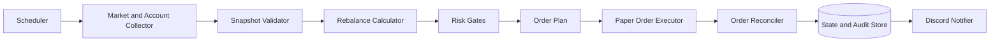

# Portfolio Rebalancer

`portfolio-rebalancer`는 장기 자산배분을 정해진 규칙에 따라 점검하고 리밸런싱하는 개인용 자동 자산관리 프로젝트입니다.

이 프로젝트의 목적은 시장을 예측하거나 단기 수익을 극대화하는 것이 아닙니다. 사람이 승인한 종목과 목표 비중을 일관되게 관리하고, 데이터 이상이나 주문 상태가 불확실할 때 거래하지 않는 안전한 실행기를 만드는 것이 목표입니다.

> 현재 상태: 설계 단계. 최종 목표는 실제 계좌에서 매일 사용할 수 있는 운영 품질이며, 구현과 검증이 끝나기 전까지 주문 기능은 paper 모드로 고정합니다.

## 제품 목표

내부 구현은 주문 장애와 부분체결까지 보수적으로 처리하되, 사용자는 복잡한 상태 머신이나 데이터베이스를 직접 다루지 않아야 합니다. 초기 설정 이후 일상적인 사용은 계좌 점검, 거래 계획 확인, 실행 결과 확인의 세 흐름으로 단순화합니다.

```text
steady setup   # 안내에 따라 계좌와 목표 비중 설정
steady check   # 현재 비중과 필요한 조치 확인, 주문 없음
steady plan    # 변경 전 예상 매수·매도와 체결 후 비중 확인
steady run     # 위험 검사 후 승인된 계획 실행
steady status  # 마지막 실행, 차단 상태와 다음 행동 확인
```

오류가 발생하면 내부 코드만 출력하지 않고 원인, 자동으로 수행한 보호 조치, 사용자가 해야 할 일과 하지 말아야 할 일을 한국어로 설명해야 합니다. 잠금이나 불명확한 주문을 해소하기 위해 사용자가 SQLite를 직접 수정하게 해서는 안 됩니다.

## 핵심 원칙

- 종목 선정과 리밸런싱을 분리합니다.
- 종목과 목표 비중은 설정으로 관리하고 프로그램이 임의로 바꾸지 않습니다.
- 매일 평가할 수 있지만 허용 범위를 벗어난 경우에만 거래합니다.
- 신규 입금과 배당금으로 부족 자산을 먼저 채우고 불필요한 매도를 줄입니다.
- 주문 결과를 추측하지 않습니다. 불확실한 주문은 복구하기 전까지 신규 주문을 차단합니다.
- 기본 실행 모드는 `paper`이며, 실거래는 별도의 명시적 승인과 제한 없이는 활성화할 수 없습니다.

## 기본 포트폴리오 철학

안정적인 장기 자산 축적을 목표로 다음 역할을 구분합니다.

- **Core**: 광범위하고 저비용인 시장 지수 상품
- **Satellite**: AI 반도체처럼 추가 확신을 표현하는 제한된 비중의 테마 자산
- **Safety**: 현금 또는 향후 지원할 안정자산

개별 종목은 코어를 대체하지 않습니다. 종목 후보는 사람이 분기 또는 반기 단위로 검토하고, 리밸런서에는 승인된 고정 목록만 전달합니다.

## 시스템 개요



자세한 요구사항과 안전 규칙은 [시스템 명세](docs/SPEC.md)를 참고하세요.

## 문서

- [시스템 명세](docs/SPEC.md)
- [구현 계획](docs/TODO.md)
- [Web GUI 설계](docs/WEB_UI.md)
- [에이전트 작업 지침](AGENTS.md)

## UX 프로토타입

현재 Web GUI의 시각·레이아웃 기준은 [`prototype/index.html`](prototype/index.html)입니다. 실제 계좌나 API를 연결하지 않고 합성 데이터로 정상, 계획 있음, 거래 차단과 실행 완료 상태를 확인할 수 있습니다.

```bash
python3 -m http.server 4173
```

서버를 실행한 뒤 `http://127.0.0.1:4173/prototype/`에서 확인합니다. 색상, 타이포그래피, 간격과 상태 의미는 [`design/tokens.css`](design/tokens.css)를 기준으로 사용합니다. 시스템 행동과 안전·접근성 계약은 [`docs/WEB_UI.md`](docs/WEB_UI.md)를 따릅니다.

## 예상 설정 형태

아래 값은 소프트웨어 구조를 설명하기 위한 예시이며 투자 권고가 아닙니다.

```yaml
portfolio:
  base_currency: KRW
  market_scope: KR

buckets:
  core:
    target_weight: 0.75
    tolerance:
      type: percentage_point
      value: 0.05
    instruments:
      - symbol: BROAD_MARKET_ETF
        market: KR
        weight_within_bucket: 1.0

  ai_semiconductor:
    target_weight: 0.15
    max_weight: 0.20
    instruments:
      - symbol: SEMICONDUCTOR_ETF
        market: KR
        weight_within_bucket: 1.0

  safety:
    target_weight: 0.10
    instruments:
      - type: cash
        currency: KRW

rebalance:
  evaluate: daily
  normal_destination: band_edge
  severe_drift:
    type: percentage_point
    value: 0.10
  severe_destination: target
  prefer_cash_flow: true

execution:
  mode: paper
```

## 개발 단계

1. 한국 시장 기준 순수 계산기와 설정 검증
2. 저장된 스냅샷을 이용한 재현 테스트
3. 토스증권 조회 API를 연결한 shadow 모드
4. 자체 모의 체결기를 사용하는 paper 모드
5. 장애 복구와 주문 정합성 검증
6. 별도 승인 후 제한된 소액 실거래 검토

각 단계는 최종 기능을 줄이기 위한 것이 아니라 실제 데이터를 안전하게 검증하기 위한 승격 과정입니다. 최종 운영 버전은 주문 원장, 중복 방지, 부분체결, 장애 복구와 위험 한도를 모두 포함해야 합니다.

실행 가능한 코드가 추가되기 전까지 이 저장소는 설계 문서를 프로젝트의 기준으로 사용합니다.

## 주의

이 프로젝트는 투자 수익을 보장하지 않습니다. 리밸런싱은 수익 예측 기능이 아니라 목표 위험 수준을 유지하기 위한 통제 장치입니다. 세금, 계좌 유형, 환전, 상품 구조 및 개인의 재무 상황은 소프트웨어 외부에서 별도로 검토해야 합니다.
