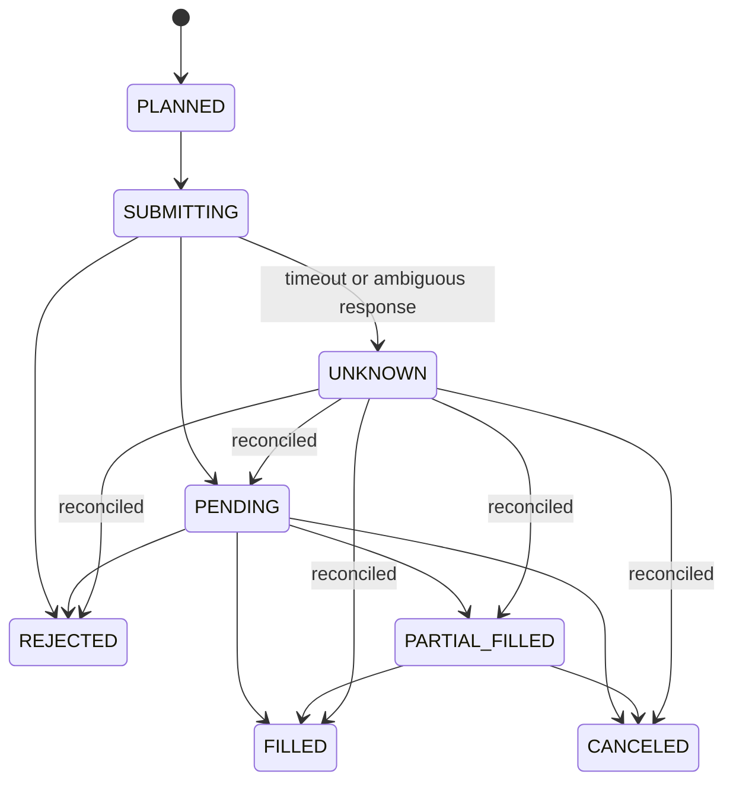
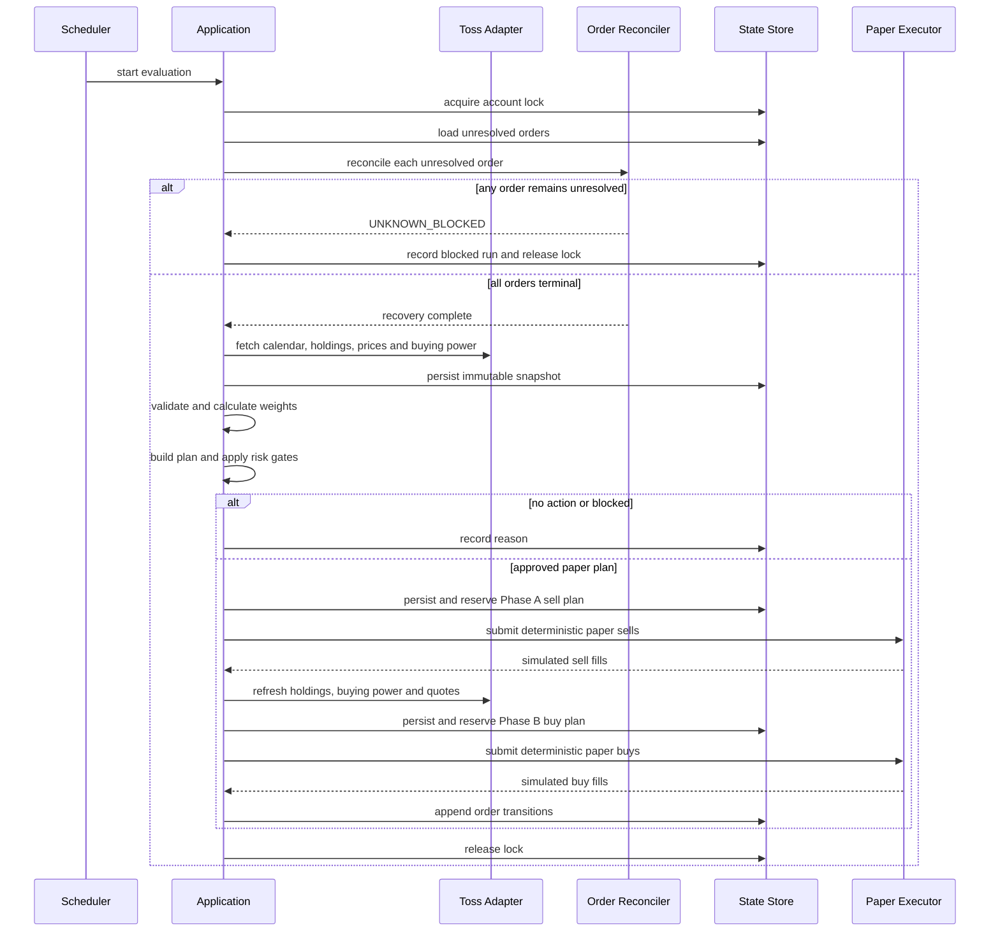

# Portfolio Rebalancer 시스템 명세

## 1. 문서 목적

이 문서는 토스증권 Open API를 데이터 및 주문 어댑터로 사용하는 개인용 자동 자산관리 시스템의 최소 요구사항을 정의합니다.

현재 명세의 최종 구현 목표는 **조회, 계산, 위험 검증, paper 검증, 안전한 실거래 및 감사 가능한 기록**입니다. 기능은 단계적으로 검증하지만 최종 완료 기준은 실제 계좌에서 지속적으로 사용할 수 있는 운영 품질입니다.

현재 구현은 실제 조회 기반 shadow 수직 슬라이스입니다. 토스 계좌·보유자산, KRW·USD 매수 가능 금액과 필요한 USD/KRW 환율을 런타임 검증하고, Prisma/PostgreSQL 불변 스냅샷으로 저장한 뒤 별도 engine 계약을 통해 6개 Web GUI 화면에 표시합니다. 매수 가능 금액은 `valuationEligible=false`인 별도 증거로 저장하며 평가용 관리 현금이나 총 포트폴리오 가치에 자동 합산하지 않습니다. 현재 보유종목의 목표와 허용 범위는 원본 스냅샷 ID·digest에 묶인 DRAFT 버전 저장과 별도 ACTIVE 전환으로 관리하며, 새 수집 시 스냅샷에 설정 버전을 고정합니다. 검증된 관리 현금, 주문 계획, 주문 원장, paper 체결과 live 실행은 아직 구현 범위에 포함되지 않습니다.

## 2. 목표

- 승인된 자산 목록의 현재 비중을 재현 가능하게 계산한다.
- 목표 비중과 허용 범위를 설정 파일로 관리한다.
- 매일 포트폴리오를 평가하되 필요한 경우에만 주문 계획을 만든다.
- 불완전하거나 오래된 데이터로는 주문하지 않는다.
- 동일 실행 또는 장애 재시작으로 주문이 중복되지 않게 한다.
- 모든 판단의 입력, 계산 결과, 차단 이유와 주문 상태를 추적할 수 있게 한다.
- paper와 향후 live 실행이 동일한 계산기와 위험 차단기를 사용하게 한다.
- 증권사 고유 API를 애플리케이션 서비스에서 분리하고, capability 기반 포트로 다른 증권사 어댑터를 추가할 수 있게 한다.

## 3. 비목표

초기 버전은 다음 기능을 지원하지 않습니다.

- 실시간 WebSocket 시세
- 뉴스 또는 소셜 데이터 분석
- 머신러닝 기반 가격 예측
- 자동 종목 발굴 및 자동 목표 비중 변경
- 기술적 지표 기반 단기 매매
- 실시간 손절 감시
- 레버리지, 인버스, 옵션, 공매도
- 다중 전략 및 하나의 실행에서 여러 증권사를 동시에 운용하는 기능
- 고급 성과 귀속 분석
- 기본 활성화된 실거래 주문

## 4. 외부 연동 경계

토스증권 Open API는 다음 용도로만 사용합니다.

- OAuth 2.0 인증
- 종목, 가격, 호가, 환율 및 시장 캘린더 조회
- 계좌와 보유 주식 조회
- 매수 가능 금액, 매도 가능 수량 및 수수료 조회
- 향후 주문 생성, 정정, 취소 및 주문 상태 조회

2026-07-16에 저장소에 고정한 공식 OpenAPI는 `3.1.0`, API 버전은 `1.2.4`입니다. operation은 OAuth 토큰 발급 1개를 포함해 30개이며, business API는 조회용 GET 23개와 계좌 상태를 변경하는 6개 operation으로 구성됩니다. `packages/broker-toss/openapi/openapi.json`을 기준 스냅샷으로 사용하고 생성 타입과 operation manifest가 이 스냅샷과 일치하는지 테스트합니다.

현재 공식 API는 REST 기반입니다. 별도의 paper 또는 sandbox 주문 API가 확인되지 않았으므로 paper 체결은 애플리케이션 내부에서 구현합니다. 계좌·보유·매수 가능 금액·USD/KRW 환율 응답은 Zod 런타임 스키마로 검증하고 redaction 후 저장합니다. 나머지 조회 operation의 중립 모델 변환과 대사는 후속 구현입니다.

클라이언트 origin은 코드 상수 `https://openapi.tossinvest.com`으로 고정하며 호출자가 임의 `baseUrl`을 주입할 수 없습니다. 토큰과 업무 요청에는 공통 10초 timeout을 적용하고, timeout·네트워크 실패와 비정상 HTTP 상태를 원문 응답 본문을 노출하지 않는 한국어 오류로 정규화합니다. `401`은 캐시 토큰을 폐기하며, `429` 오류에는 정수형 `Retry-After`, rate-limit group과 request ID 메타데이터를 가능한 범위에서 보존합니다.

계좌를 변경하는 6개 호출은 현재 `TOSS_LIVE_TRADING_DISABLED` 오류로 전송 전에 무조건 차단되며 활성화 경로를 공개하지 않습니다. 주문 원장, 멱등성, 한도, 위험 차단과 복구가 완성되고 별도 실거래 설계 검토를 통과하기 전에는 실제 주문 엔드포인트를 호출할 수 없습니다. 현재 제품 모드는 실제 데이터를 읽되 주문하지 않는 `shadow`입니다.

공식 명세 parity를 위해 전송 패키지는 이 6개 쓰기 operation의 타입과 명시적 메서드를 보유하지만, `TOSS_TRANSPORT_DESCRIPTOR`는 transport가 제공하는 18개 read-only capability만 설명합니다. `orders.write`와 `orders.conditional.write`는 포함하지 않습니다. 중립 어댑터와 실제 계좌 연결이 없으므로 애플리케이션은 이 목록을 활성 제품 기능으로 광고하지 않습니다.

운영 환경은 허용 IP 등록과 고정된 출구 IP가 필수입니다. Vercel engine 프로젝트는 Pro Static IPs 또는 Enterprise Secure Compute를 사용하고 해당 주소를 토스증권에 등록해야 합니다. `TOSS_EGRESS_ALLOWLIST_CONFIRMED=true`가 없으면 Vercel 런타임의 실제 수집을 코드에서 차단합니다. 현재 전송 계층은 `retry-after`, `x-ratelimit-group`, `x-request-id` 또는 `x-toss-request-id`를 읽어 안전 오류의 메타데이터로 제공합니다. 실제 응답에서 각 헤더가 항상 제공되는지는 실계좌 read-only 표본으로 검증하기 전까지 `[확인 필요]`입니다. 자동 재시도, jitter와 그룹별 client-side limiter는 아직 구현하지 않았으며, 쓰기 요청은 일반 재시도 대상이 아닙니다.

이 절은 2026-07-16에 다음 공식 자료와 저장소 고정 명세를 확인한 결과입니다. 동기화 시점에는 반드시 버전과 operation 변경을 검토합니다.

- [Open API 개요](https://openapi.tossinvest.com/openapi-docs/overview.md)
- [공식 OpenAPI JSON](https://openapi.tossinvest.com/openapi-docs/latest/openapi.json)
- [주문 생성 요청 모델](https://openapi.tossinvest.com/openapi-docs/latest/api-reference/Models/OrderCreateRequest.md)

세부 operation 범위, 동기화 절차와 현재 제한은 [토스증권 API 연동](API_TOSS.md)을 따릅니다.

### 4.1 증권사 추상화 경계

애플리케이션은 토스의 path, 요청 DTO와 원본 상태에 직접 의존하지 않습니다.

```text
apps/web -> apps/engine -> application -> broker ports -> domain
                        -> database (Prisma/PostgreSQL)
                                      ^
                                      |
                     future Toss neutral adapter
                                      ^
                                      |
                         broker-toss transport
```

- `packages/domain`: 증권사와 네트워크를 모르는 값 객체와 순수 계산
- `packages/broker`: 계좌, 보유, 시세, 호가, 종목, 캘린더, 일반·조건주문 조회와 pretrade 기능을 드러내는 capability와 좁은 포트
- `packages/broker-toss`: 공식 OpenAPI 생성 타입, 인증과 토스 전송 계층. 중립 어댑터는 후속 범위
- `packages/application`: 필요한 capability를 조합하는 유스케이스
- `apps/engine`: Toss 자격증명, 수집, Prisma와 PostgreSQL을 소유하는 NestJS 11 애플리케이션. Fastify adapter를 사용하며 `system`과 `portfolio` feature module, Controller, Guard와 singleton Provider로 구성한다. DB client 수명주기는 `PrismaModule`의 `PrismaService`가 관리한다. `src/main.ts`는 일반 Nest bootstrap 하나만 소유하고 `NestFactory.create()`와 `app.listen()`을 직접 호출한다. Vercel 프로젝트 Root Directory는 `apps/engine`이며 framework, handler, rewrite 또는 `functions` glob을 별도로 선언하지 않는다. platform `PORT`를 `ENGINE_PORT`보다 우선하고 host 기본값은 로컬 `127.0.0.1`, Vercel `0.0.0.0`으로 해석한다. 배포는 별도 webpack 번들 없이 Vercel NestJS zero-config를 사용하며, 함수 추적에 필요한 runtime workspace 패키지만 빌드 전에 CommonJS `dist`로 컴파일한다.
- `apps/web`: engine 결과를 공유 Zod 계약으로 재검증한 뒤 브라우저에 전달한다. 로컬과 host-run production은 `127.0.0.1:13000`에만 bind하고 `home-server` Caddy의 `stock.fredly.dev` route를 외부 진입점으로 사용한다.

로컬 비밀정보도 실행 경계별 `.env.local`로 분리한다. Web은 engine URL과 service token만, engine은 Toss 자격증명과 runtime database URL만, Prisma migration은 direct database URL만 소유한다. 루트 `.env`를 런타임 공용 secret store로 사용하지 않는다. Vercel에서는 같은 경계를 Project와 Production/Preview 환경 단위로 적용한다.

새 증권사는 별도 어댑터 패키지에서 중립 포트를 구현하고, 지원하지 않는 기능은 capability에 선언하지 않습니다. 최소 공통분모를 넓혀 증권사 차이를 숨기지 않으며, 필수 capability가 없으면 주문 계획을 만들지 않고 한국어 오류로 차단합니다. 브로커 원본 응답과 상태는 대사·감사를 위해 보존하되 도메인 모델과 분리합니다.

`GET /api/v1/brokers`는 engine이 저장한 최신 스냅샷의 실제 연결 상태와 `read_only_adapter` 상태를 반환합니다. 공식 OpenAPI와 transport가 제공하는 기능 목록은 실제 계좌에 연결된 제품 capability와 다른 계약입니다. UI와 애플리케이션은 연결·어댑터 상태를 함께 확인하고, transport 목록만으로 기능을 활성화하지 않습니다.

## 5. 시스템 구성요소

### 5.1 Scheduler

- 평가 실행을 하루 1회 예약한다.
- 첫 운영 시장은 한국으로 제한한다. 한국 시장의 운영 안정성을 확인한 뒤 미국 시장은 별도의 스케줄과 통화 모델로 확장한다.
- 시장 캘린더와 장 상태를 확인하지 못하면 주문 단계를 실행하지 않는다.

### 5.2 Market and Account Collector

하나의 평가 실행에서 다음 데이터를 수집합니다.

- 평가용 종가 또는 최근 체결가와 관측 시각
- 주문 가능성 판단용 bid, ask, 시장 세션과 quote 관측 시각
- KRW/USD 환율(후속 복수 통화 지원 시)
- 보유 종목과 수량
- 통화별 현금 기반 매수 가능 금액
- 기존 미체결 주문
- 주문 직전 매도 가능 수량과 수수료

일 1회 전략에는 15분 주기 저장이 필수 요구사항이 아닙니다. 평가 시점과 주문 제출 직전에 가격을 조회하는 것을 기본으로 합니다.

### 5.3 Snapshot Validator

수집 결과를 불변 스냅샷으로 저장한 뒤 다음을 검증합니다.

- 필수 데이터의 누락 여부
- 각 데이터의 조회 시각과 최대 허용 나이
- 종목, 시장 및 통화의 일관성
- 설정되지 않은 보유자산 존재 여부
- 환율 유효성
- 가격이 0 이하이거나 직전 관측과 비정상적으로 차이 나는지 여부

설정 외 보유자산은 자동 매도하지 않고 `UNMANAGED_ASSET`으로 분류하여 주문을 차단합니다.

### 5.4 Portfolio Valuator

기준 통화로 자산을 환산하고 다음 값을 계산합니다.

```text
asset_value = quantity × latest_price × fx_rate
portfolio_value = sum(asset_value) + operational_cash
current_weight = asset_value / portfolio_value
```

`buying power`는 주문 가능성 검증에만 사용하며 평가용 현금과 동일시하지 않습니다. 현금 목표를 활성화하려면 보유자산 평가액과 중복되지 않고 미결제 금액과 대기 주문을 정확히 반영하는 현금 source of truth를 fixture 및 실계좌 표본으로 검증해야 합니다. 검증 전에는 사용자가 명시적으로 입력한 `managed_cash`만 평가에 사용할 수 있으며, 입력이 없으면 현금 비중 계산을 차단합니다.

수집한 통화별 `cashBuyingPower`는 `BuyingPowerSnapshot`으로 고정하며 원화 환산 참고값,
관측 시각과 `valuationEligible=false`를 함께 저장합니다. 이 값이 존재하더라도 사용자가
관리 범위를 선택하고 현금 source of truth 검증을 통과하기 전에는
`PortfolioSnapshot.managedCashMinor`를 채우지 않습니다.

### 5.5 Rebalance Calculator

계산기는 주문 API를 호출하지 않는 순수 함수여야 합니다.

입력:

- 검증된 포트폴리오 스냅샷
- 버전이 지정된 목표 설정
- 비용 및 수량 반올림 정책

출력:

- 현재 및 목표 비중
- 비중 이탈값
- 거래 필요 여부와 이유
- 자산군별 목표 거래금액
- 종목별 주문 후보
- 반올림 후 예상 비중

거래 필요 여부의 밴드 판정은 화면 표시용 비중을 사용하지 않습니다. `valueMinor × 10000`과 `bandBasisPoints × totalValueMinor`를 `bigint`로 교차 비교해 1bp 미만 이탈도 검출합니다. 화면에는 basis point의 100분의 1 단위까지 별도 직렬화하지만 이 표시값도 주문 판단의 입력이 될 수 없습니다.

#### 기본 리밸런싱 규칙

- 매일 평가하되 허용 범위 안에서는 거래하지 않는다.
- 정상 이탈은 밴드 경계까지만 복귀한다.
- 심각한 이탈은 목표 비중까지 복귀할 수 있다.
- 신규 입금, 배당 및 남은 현금으로 부족 자산을 우선 매수한다.
- 최소 주문금액보다 작은 거래는 누적 편차로 남긴다.

매수에 사용할 수 있는 현금은 안전자산 목표와 예약 금액을 침해하지 않게 계산합니다.

```text
spendable_cash = max(0, verified_managed_cash - cash_target_value - reserved_cash - fee_buffer)
```

작은 목표 비중에는 다음 혼합 밴드를 사용할 수 있습니다.

```text
allowed_drift = min(5 percentage points, target_weight × 25%)
```

이 공식은 기본값 후보이며 실제 값은 설정으로 변경할 수 있어야 합니다.

### 5.6 Risk Gate

다음 조건 중 하나라도 충족하면 주문 계획을 거부합니다.

- 가격, 계좌, 보유자산, 환율 또는 장 상태 조회 실패
- 데이터가 허용 시간보다 오래됨
- 기존 미체결 또는 상태 불명 주문 존재
- 같은 계좌에 대한 다른 실행이 진행 중
- 수동 킬 스위치 활성화
- 설정 외 종목 또는 허용되지 않은 시장
- 투자경고, 거래 제한 또는 상장 상태 이상
- 매수 가능 금액 또는 매도 가능 수량 부족
- 일일 최대 거래금액 또는 회전율 초과
- 단일 주문 최대 금액 초과
- 종목, 자산군 또는 전체 위험자산 최대 비중 초과
- 주문 직전 가격이 계획 가격에서 허용 범위 이상 벗어남
- 최소 주문금액 미달
- 설정 검증 실패

일일 회전율은 실행이 아니라 계좌와 한국 시장 거래일을 기준으로 누적합니다.

```text
daily_turnover =
  (trade_day_filled_gross_notional + conservatively_reserved_pending_notional)
  / first_valid_portfolio_snapshot_value_of_trade_day
```

부분체결은 실제 체결금액과 남은 예약금액으로 나누어 반영하고, 취소된 잔량의 예약만 해제합니다. 한도 확인과 예약은 하나의 DB 트랜잭션으로 처리하여 병렬 실행이 같은 한도를 동시에 통과하지 못하게 합니다.

### 5.7 Order Planner

계산 결과를 실제 주문 후보로 변환합니다. 매도와 매수가 모두 필요한 실행은 두 단계 saga로 처리합니다.

- 수수료와 예상 슬리피지를 반영한다.
- 첫 운영 시장인 한국의 정수 수량 규칙을 적용한다.
- 호가 단위와 상·하한가를 검증한다.
- Phase A 매도 계획을 저장·한도 예약·제출·대사한다.
- 새로운 보유자산, 매수 가능 금액과 quote 스냅샷을 수집한다.
- Phase B 매수 계획을 새 버전으로 재계산하고 위험 규칙을 다시 평가한다.
- 예상 매도대금만을 근거로 매수 주문을 만들지 않는다.

두 계획은 같은 `rebalance_run_id` 아래 별도의 `plan_version`을 가지며, 매도 부분체결 시 확인된 가용 현금만 Phase B에서 사용할 수 있습니다.

### 5.8 Order Executor

공통 인터페이스 뒤에 실행 모드를 분리합니다.

```text
OrderExecutor
├── PaperOrderExecutor
└── TossOrderExecutor (future, disabled by default)
```

paper 체결기는 다음을 지원해야 합니다.

- 시장가 매수는 유효한 ask, 매도는 유효한 bid를 기준으로 보수적인 가상 슬리피지 적용
- 지정가가 이후 관측 가격을 통과한 경우에만 체결
- 수수료 반영
- 선택 가능한 부분체결 시뮬레이션
- 가격 데이터가 없으면 미체결 처리

bid/ask 또는 관측 시각이 없거나 오래됐으면 paper 체결도 금지합니다. OHLC만으로는 장중 체결 순서와 체결 가능 수량을 알 수 없으므로 지정가 paper 결과에는 이 한계를 기록합니다.

### 5.9 Order Reconciler

주문 제출 결과가 불확실하면 실패로 간주하지 않습니다. 주문 목록과 상세 조회로 상태를 복구하기 전까지 신규 주문을 차단합니다.



브로커의 원본 주문 상태와 내부 정규화 상태를 별도로 저장하고, 허용 전이는 공식 응답 fixture로 검증합니다. `UNKNOWN`은 종료 상태가 아니며 자동 재제출할 수 없습니다.

향후 live 주문의 `clientOrderId`는 canonical order intent에서 비밀정보를 제외한 해시와 버전으로 결정적으로 생성합니다.

```text
clientOrderId = short_hash(canonical_order_intent) + version
```

토스의 `clientOrderId`는 최대 36자이고 영숫자, `-`, `_`만 허용되며 서버 멱등성은 10분 동안만 유효합니다. 따라서 이는 보조 방어선일 뿐입니다. 중복 방지의 주 수단은 로컬 원장의 `logical_order_id` UNIQUE 제약과 재시작 시 주문 대사입니다. 10분이 지난 뒤에도 상태를 확정하지 못하면 자동 재제출하지 않고 `UNKNOWN_BLOCKED`로 전환하여 운영자 개입을 요구합니다.

### 5.10 State and Audit Store

운영 저장소는 Prisma가 migration을 소유하는 PostgreSQL을 사용합니다. Vercel 운영 기본 경로는 engine 프로젝트에 연결한 Marketplace Supabase이며, Integration이 자동 주입하는 `POSTGRES_PRISMA_URL`을 runtime pooled 연결에, `POSTGRES_URL_NON_POOLING`을 migration direct 연결에 사용합니다. 기존 `DATABASE_URL`과 `DATABASE_DIRECT_URL`은 로컬·호환 fallback으로만 유지합니다. 최소 저장 대상은 다음과 같습니다.

- 실행 ID, 계좌 식별자의 마스킹 값, 시작·종료 시각
- 설정 버전 및 파일 해시
- 애플리케이션 버전
- 입력 데이터 스냅샷
- 비중 계산과 주문하지 않은 이유
- 통과 및 실패한 위험 규칙
- 주문 계획과 `clientOrderId`
- 브로커 주문 ID와 마스킹된 요청·응답
- 상태 변경, 체결 수량, 평균 체결가, 비용
- 외부 API의 추적용 request ID
- 알림 전송 결과

수평 확장되는 Vercel Function을 고려합니다. 현재 Toss 수집은 PostgreSQL의 만료 lease와 fencing token으로 직렬화합니다. 수집기는 계좌 선택 뒤와 최종 저장 전에 owner·fencing token이 일치하는 lease를 heartbeat하며, 스냅샷 저장 트랜잭션은 DB `NOW()` 기준으로 만료되지 않은 같은 token을 `FOR UPDATE`로 다시 확인합니다. 소유권을 잃은 실행은 `COLLECTION_LEASE_LOST`로 실패하고 어떤 스냅샷 증거도 쓰지 않습니다. 최신 화면과 목표 설정은 전체 DB의 최신값이 아니라 가장 최근 수집 계좌로 범위를 제한합니다. 계획 저장·논리 주문 고유성·일일 한도 예약도 향후 PostgreSQL 트랜잭션으로 묶습니다. 정상 종료에서는 owner·token이 모두 일치할 때만 lease를 해제하고 비정상 종료는 만료와 복구 절차로 처리합니다.

비밀키, 액세스 토큰 및 전체 계좌번호는 로그에 저장하지 않습니다.

### 5.11 Notifier

Discord 알림의 최소 이벤트는 다음과 같습니다.

- 리밸런싱 계획 생성
- 주문 성공, 거부, 취소 또는 부분체결
- 위험 차단기 작동
- `UNKNOWN` 주문 또는 정합성 복구 실패
- 킬 스위치 상태 변경

알림 실패가 주문 재제출로 이어져서는 안 됩니다.

### 5.12 Operator Interface

운영 인터페이스는 내부 복잡성을 숨기고 다음 작업을 안전하게 제공해야 합니다.

Web GUI를 주 운영 인터페이스로 제공하고, CLI는 자동화·진단·복구를 위한 보조 인터페이스로 유지합니다. 두 인터페이스는 동일한 애플리케이션 서비스, 리밸런싱 계산기, Risk Gate와 주문 원장을 사용해야 하며 계산 또는 주문 판단을 프런트엔드에 복제하지 않습니다. 세부 화면과 사용자 흐름은 [Web GUI 설계](WEB_UI.md)를 따릅니다.

- `setup`: 설정 파일 위치와 스키마를 몰라도 안내에 따라 계좌, 종목, 목표 비중과 한도를 구성한다.
- `doctor`: 비밀정보 존재 여부, 허용 IP, 토스 API 연결, 계좌 선택, 데이터 조회와 Discord 연결을 주문 없이 점검한다.
- `check`: 실제 계좌를 읽고 현재 비중, 허용 범위와 조치 필요 여부를 보여주며 주문하지 않는다.
- `plan`: 설정 변경 전후와 예상 주문·수수료·체결 후 비중을 보여준다.
- `run`: 위험 검사를 통과한 계획만 실행하고 실거래에서는 명시적 승인 정책을 적용한다.
- `status`: 마지막 성공, 마지막 실패, 킬 스위치, 미해결 주문과 다음 실행 상태를 한 화면에 표시한다.
- `explain`: 실행 ID 또는 차단 코드의 의미와 사용자가 취할 행동을 한국어로 설명한다.
- `recover`: DB 직접 수정 없이 미해결 주문과 만료된 잠금을 대사하며, 안전을 확인할 수 없으면 계속 차단한다.

모든 실행은 `NO_ACTION`, `PLANNED`, `EXECUTED`, `BLOCKED`, `FAILED` 중 하나의 결론과 사람이 읽을 수 있는 이유를 출력합니다. 고급 YAML 편집은 지원하되 필수 사용 경로가 되어서는 안 됩니다.

브라우저는 토스증권 API를 직접 호출하지 않으며 비밀정보를 전달받지 않습니다. 설정 저장과 계획 생성, 주문 제출은 각각 분리된 동작이어야 합니다. `UNKNOWN`, 부분체결 또는 기존 미체결 주문이 있으면 신규 주문과 수동 재제출을 차단하고 서버 측 논리 주문 키와 멱등성 검사로 새로고침, 중복 클릭과 네트워크 재시도에 의한 중복 주문을 방지합니다.

현재 Web GUI는 `/`, `/portfolio`, `/rebalancing`, `/orders`, `/troubleshooting`, `/settings`를 제공합니다. 포트폴리오와 리밸런싱은 스냅샷에 고정된 설정만 읽고, 주문·기록은 실제 수집 기록과 `orderLedgerState=NOT_IMPLEMENTED`를 분리해 표시합니다. 문제 해결의 재점검은 기존 read-only 수집만 호출하며 주문 복구나 잠금 강제 삭제를 제공하지 않습니다.

## 6. 종목 선정 정책

종목 선정은 자동 리밸런싱의 책임이 아닙니다.

- 코어는 광범위 시장, 낮은 비용, 충분한 유동성과 단순한 지수 방법론을 우선한다.
- 테마 ETF는 상위 종목 집중도와 코어 자산과의 중복을 확인한다.
- 개별 종목은 사업 이해도, 재무 품질, 가격, 위험 및 유동성을 사람이 검토한다.
- 종목 후보 검토는 분기 또는 반기, 목표 정책 변경은 연 1회 이하를 기본으로 한다.
- 가격 상승이나 하락만으로 종목을 교체하지 않는다.
- 레버리지, 인버스 및 단일 종목 레버리지 상품은 허용 목록에서 제외한다.

## 7. 설정 검증

애플리케이션 시작 시 다음을 확인합니다.

- 자산 ID가 비어 있지 않고 서로 고유한지
- 목표 비중 합이 1인지
- 자산군 내부 종목 비중 합이 1인지
- 같은 종목이 의도 없이 중복됐는지
- 종목별 시장과 통화가 일치하는지
- 자산군 목표와 종목 최대 비중이 모순되지 않는지
- `execution.mode`가 허용된 값인지
- 모든 임계값의 단위가 명시됐는지
- 각 허용 범위가 `0 <= lower <= target <= upper <= 100%`인지
- 검증된 관리 현금과 `cash` 자산 평가액이 정확히 일치하는지
- live 모드에 필요한 별도의 승인 값이 모두 존재하는지

live 활성화에는 하나의 플래그만 사용하지 않습니다. 향후 구현 시 최소한 실행 모드, 계좌 허용 목록, 주문 한도 및 수동 승인 토큰을 함께 요구합니다.

현재 목표 설정 API는 최신 스냅샷의 모든 보유자산을 정확히 한 번씩 포함하고, 목표 합이 `10000bp`이며 각 밴드가 `0 <= lower <= target <= upper <= 10000bp`인지 검증합니다. 클라이언트가 보낸 종목명·시장·통화를 신뢰하지 않고 최신 스냅샷에서 파생합니다. 초안 source와 content hash에는 원본 스냅샷 ID·digest를 포함합니다. 저장과 적용 트랜잭션은 DB의 최신 스냅샷을 다시 읽으며, 원본과 다르면 `DRAFT_STALE`로 아무 설정도 변경하지 않고 새 초안을 요구합니다. 초안 저장은 기존 ACTIVE를 변경하지 않으며, 별도 적용 트랜잭션에서 이전 ACTIVE를 RETIRED로 전환합니다. 활성 버전과 최신 스냅샷의 고정 버전이 다르면 `TARGET_CONFIG_STALE`로 계획과 주문을 차단하고 새 read-only 수집을 요구합니다.

## 8. 최소 실행 흐름



## 9. 운영 모드

### Calculator

외부 호출 없이 저장된 입력으로 계산 결과만 생성합니다.

### Shadow

실제 계좌와 가격을 조회하고 주문 계획까지 만들지만 주문을 실행하지 않습니다.

현재 shadow 수직 슬라이스는 목표 범위 판정까지만 구현되어 있으며 관리 현금, pretrade 검사와 원장이 없으므로 주문 계획도 생성하지 않습니다.

### Paper

실제 또는 저장된 시장 데이터를 사용하되 내부 모의 체결기만 호출합니다.

### Live

향후 범위입니다. 기본적으로 비활성화하며 별도 설계 검토, 승인, 소액 한도 및 운영 런북 없이 구현 완료로 간주하지 않습니다.

## 10. 완료 기준

실사용 가능한 운영 버전은 다음 조건을 만족해야 합니다.

- 같은 스냅샷과 설정에서 항상 같은 주문 계획을 생성한다.
- 허용 범위 안에서는 주문 계획이 생성되지 않는다.
- 모든 필수 조회 실패가 주문 차단으로 이어진다.
- 수량 반올림 후 비중과 한도를 다시 검사한다.
- 병렬 실행이 하나의 계좌 주문을 중복 생성하지 않는다.
- 프로세스 재시작 후 미완료 주문 상태를 복구한다.
- 10분 멱등성 경계 이후 불명확 주문을 자동 재제출하지 않는다.
- 같은 거래일에 여러 번 실행해도 일일 한도가 누적 적용된다.
- paper 체결과 수수료가 감사 로그에 남는다.
- 비밀정보가 로그와 Discord 메시지에 포함되지 않는다.
- 외부 API 없이 핵심 계산과 위험 규칙을 테스트할 수 있다.
- 신규 사용자가 문서만 보고 로컬 PostgreSQL과 read-only 계좌 점검을 수행할 수 있다.
- 종목이나 목표 비중 변경 후 실제 주문 전에 영향을 미리 볼 수 있다.
- 차단 또는 상태 불명 상황에서 DB를 직접 수정하지 않고 원인 확인과 안전한 복구를 수행할 수 있다.
- 평상시 사용에는 `check`, `plan`, `run`, `status` 이외의 내부 명령이 필요하지 않다.

## 11. 확인이 필요한 결정

- 평가용 현금의 source of truth와 미결제·대기주문 반영 규칙
- 기본 가격 최대 허용 나이와 슬리피지 한도
- 세금과 환전 비용을 계산기에 포함할 시점
- Discord webhook 운영 및 비밀정보 관리 방식
- 실거래 전 수동 승인 UX와 소액 한도
